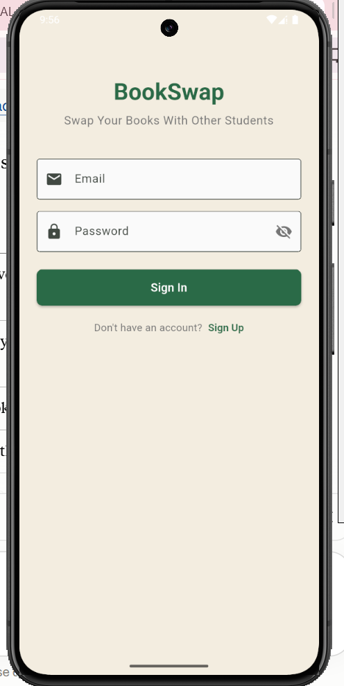
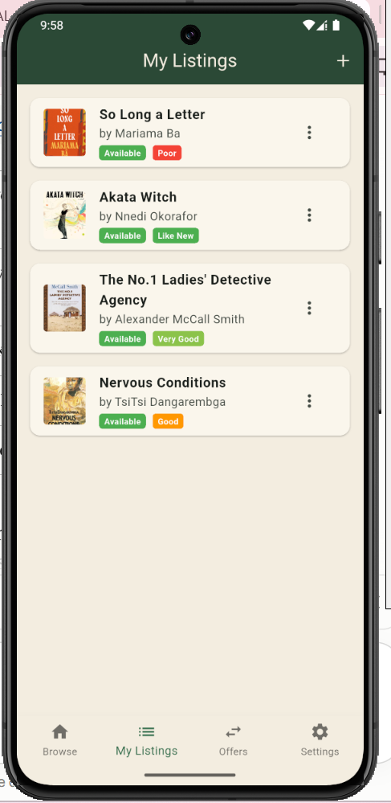
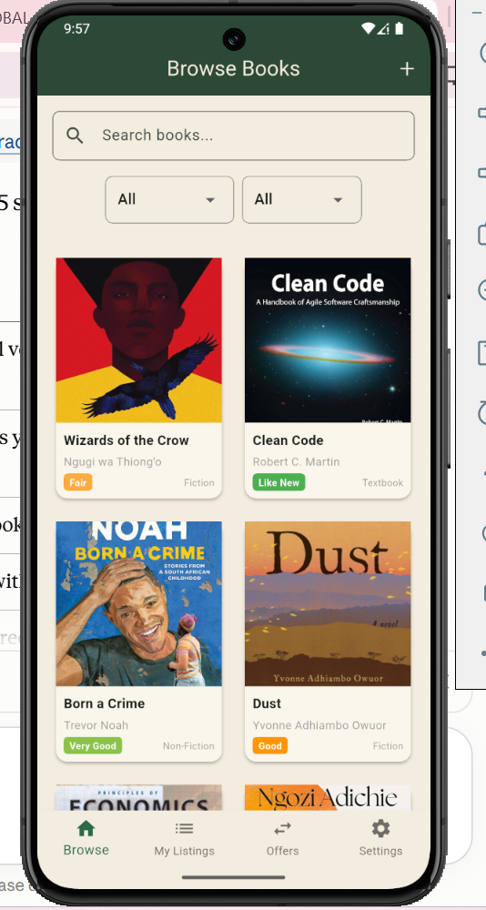
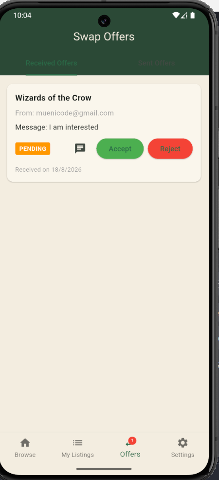

# BookSwap - Flutter Firebase Textbook Exchange App

A modern Flutter application that enables students to exchange textbooks seamlessly using Firebase backend services. BookSwap demonstrates complete mobile development with authentication, real-time data synchronization, and complex state management.


##  Features

### Authentication & Security
- **Email/Password Authentication** with Firebase Auth
- **Email Verification** flow with proper UI routing
- **Automatic Session Management** with Riverpod state

###  Book Management (CRUD Operations)
- **Create Listings** - Add textbooks with images and details
- **Real-time Reading** - Live updates across all devices
- **Update Listings** - Modify book conditions and swap preferences
- **Delete Books** - Swipe-to-delete with confirmation

###  Swap System
- **Make Offers** - Propose book exchanges to other users
- **Manage Offers** - Accept/reject incoming swap requests
- **Dual Perspectives** - Separate views for sent vs received offers
- **Real-time Status Updates** - Instant notification of offer changes

### In-App Chat
- Real-time messaging between users tied to a swap (`chat_room`, `chat_message` models)
- Dedicated chat list and conversation screens

### Push Notifications (server-side)
- Firebase Cloud Functions listen for Firestore writes and push notifications via FCM:
   * New swap offer → notifies the recipient
   * New chat message → notifies the other participant
- Local notification handling on-device via `flutter_local_notifications`

###  Navigation & State
- **Bottom Navigation** - Four main tabs: Browse, My Listings, Chats, Settings
- **Riverpod State Management** - Clean, testable architecture
- **Persistent State** - Maintains data across navigation
- **Optimized Queries** - Efficient Firestore data fetching

## Architecture

! [Architecture Diagram](assets/images/architecture.jpg)

The app follows a layered structure:
* `lib/models/`- plain Dart data classes ( `Book`, `ChatRoom`, `ChatMessage`, `SwapOffer`, `UserProfile`)
* `lib/services/` - Firebase integration (`auth_service`, `firestore_service`, `chat_service`, `storage_service`, `notification_service`)
* `lib/providers/` - Riverpod providers wiring services to UI state
* `lib/screens/` - UI, one file per screen
* `functions/` - Cloud Functions backend (Node.js) for push notifications

##  Technology Stack

| Layer | Technology | Purpose |
| :--- | :--- | :--- |
| **Frontend** | Flutter 3.19 / Dart 3.0 | Cross-platform UI |
| **Auth** | Firebase Auth | User accounts & email verification |
| **Database** | Cloud Firestore | Real-time NoSQL data |
| **Storage** | Firebase Storage | Book photo uploads |
| **State Management** | Riverpod | App-wide state |
| **Push Notifications** | Firebase Cloud Functions + FCM | Server-triggered notifications |
| **Local Notifications** | flutter_local_notifications | On-device notification display |


##  Screenshots

| Authentication | My Listings | Browse Books | Swap Offers |
|----------------|-------------|--------------|-------------|
|  |  |  |  |


## Architecture
[!diagram](https://1drv.ms/i/c/47659f4dae4e3118/EZ0JB0uT5-dNg2C0NewvvTYBAUmzu__5KYF-T51WJAgjmA?e=ftfuBu)


##  Getting Started

### Prerequisites
- Flutter SDK 3.19.0 or higher
- Dart 3.0 or higher
- Firebase project with enabled services
- Android Studio/VSCode with Flutter extension

### Installation

1. **Clone the repository**
   ```bash
   git clone https://github.com/Muen1/bookswap.git
   cd bookswap

2. **Firebase setup**
Create Firebase Project
 Go to Firebase Console
 Create new project: bookswap-flutter
 Enable Authentication with Email/Password
 Create Firestore Database in test mode
 Create Storage Bucket
Run `flutterfire configure` to generate `lib/firebase_options.dart` for your project

3. **Install Dependencies**
   ```bash
   flutter pub get
   ```

4. **(Optional) Deploy Cloud Functions for push notifications**
```bash
cd functions
   npm install
   firebase deploy --only functions
```

5. **Run the app**
   ```bash
   flutter run

6. **Code Quality**
```bash
flutter analyze
dart format .
```


